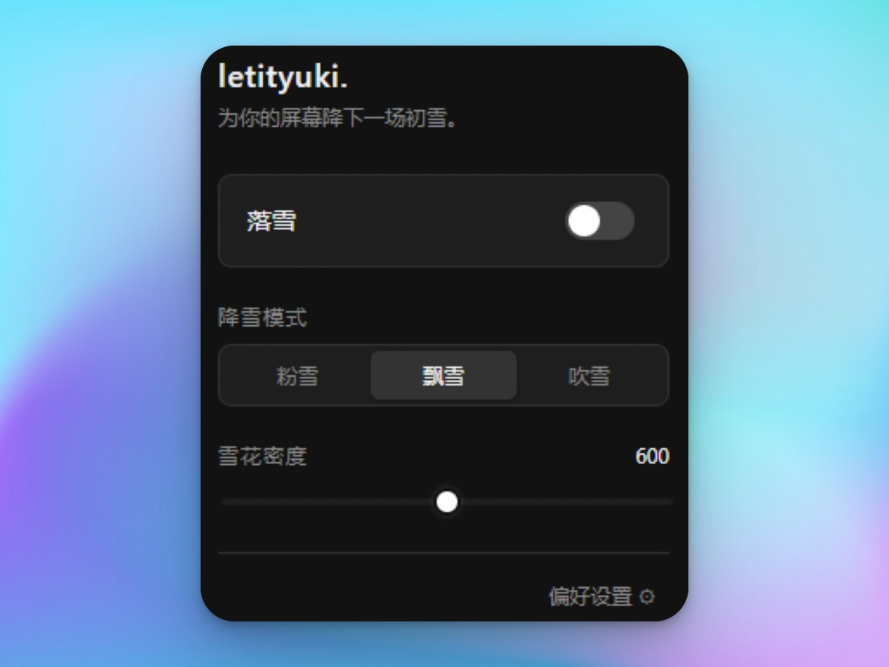

<!--  -->

# ❄️ letityuki.

*为你的屏幕降下一场初雪。*

 

> 之前在 Google AI Studio 出一个下雪彩蛋，那种安静、不打扰的氛围简直是深夜对话的绝佳「视觉白噪音」（现在这个彩蛋悄悄下架了 😭）。
> 
> 既然官方不给用，干脆自己手搓一个，顺便让**所有网页**都能下雪。利用视差滚动和透明度映射，勉强在 2D 网页里骗出了点 3D 景深。不干扰操作，主打一个温和陪伴。

 

### 核心特性

- **假装有 3D（视差景深）**：近处的雪花大而清晰落得快，远处的雪花小而半透飘得慢，用物理视差强行拉出层次感。
- **极其流畅**：纯原生 Canvas 绘制，**坚决不往你的 DOM 树里塞满屏的 `div` 垃圾**。引入对象池循环复用 200 个雪花，就算密度拉满也稳稳跑在 60 帧，内存毫无波澜。
- **三角函数风**：放弃了直上直下的逻辑，套了个正弦波（`Math.sin()`）让雪花走出自然的“S 型”，每片雪花都有自己的摆动频率。
- **告别像素点**：结合径向渐变与 `shadowBlur`，让雪花看起来毛茸茸的。
- **深浅色自动切换**：如果网页是**深色模式**，雪花会采用 `lighter` 混合模式像发着微光；如果是**浅色模式**，会自动切成 `source-over` 带点淡蓝色半透明阴影，确保雪下得优雅。
- **极简面板**：能一键启停就绝不多点一下。
- **懂你的语言**：自动适配简体中文、英文、日语。

 

### 安装指南

因为嫌麻烦（其实是还没来得及上架 Chrome 商店），目前只能手动加载一下：

1. **下载解压**：去 [Releases 页面](https://github.com/lennon624/Let-it-Yuki/releases)，下载最新版的 `letityuki-v1.x.x.zip` 并解压。
2. **打开扩展页**：浏览器输入 `chrome://extensions/`（Edge 是 `edge://extensions/`）。
3. **硬核加载**：
   - 打开右上角的「开发者模式」。
   - 点击「加载已解压的扩展程序」，选中刚才解压出来的文件夹。

*搞定。建议把拼图图标固定在工具栏，方便随时看雪。*

 

### 使用说明

点开右上角 ❄️ 图标，呼出面板：

- **落雪**：总开关，一键下雪。
- **降雪模式**：
  - `粉雪`：存在感极低，适合需要极度专注的代码/阅读时间。
  - `飘雪`：默认模式，雪量刚刚好。
  - `吹雪`：满屏暴风雪，适合发呆摸鱼。
- **雪花密度**：嫌雪不够大？拉动滑块自己造。

 

### 开源协议

本项目基于 [MIT License](./LICENSE) 协议开源。拿去随便玩。

 

  💗 Come feel the heat, forever and forever. 💗

